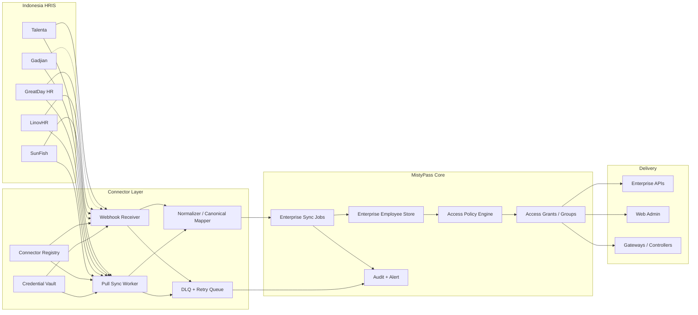

# 印尼 HRIS 接入架构（云访问控制 SaaS）

当前能力状态：

- `CONTRACT_READY`：Talenta 单厂商主线路由、worker、告警、运行态与前端处置合同已收口，可作为当前交付与联调基线；多厂商扩张仍按新优先级另行排期。
- `FOUNDATION_IN_PROGRESS`：`enterprise sync` 扩展字段、`Connector Registry`、`Webhook Receipt`、`Credential Vault`、`HRIS normalizer registry`、`Talenta` 首版主员工事件映射、`Talenta` HMAC 验签、webhook DLQ / retry，以及首版 `Pull Sync Worker` + `Talenta` 员工分页拉取基线已落地；`sync-worker-alerts` 也已补 notifications / dispatch / retry / retry-batch / suppress-batch / restore-batch / auto-retry 最小闭环，且 dispatch 候选已按 `worker_action + connector_id + vendor + failure_stage + mode + event_type` 的 granular bucket 对齐 cooldown 语义；notification history 现已带 `next_retry_at` 退避时间，并同时支持 due-now HTTP auto retry 与配置化后台 ticker worker。wallet/provider 回执也已沉淀到 `channel_results.provider_delivery_id / provider_delivery_status`，并在 list / export / dispatch / retry / batch retry / auto-retry 入口先做最小 provider reconciliation：若 latest `dispatch_commit_unknown` 能被外部 receipt 确认，系统会追加新的 `sent + reason=dispatch_commit_confirmed` history 并刷新 cooldown；若 receipt 明确返回负向终态，则会追加 `failed + reason=dispatch_commit_rejected`；若长时间仍停留在 `accepted/queued/not_found` 等非终态，则会追加 `failed + reason=dispatch_commit_confirmation_timeout`，并交还给后续 retry/auto-retry 处置。确认中的 pending history 现也会额外暴露 `pending_age_seconds`，并继续累计 `confirm_attempts / last_confirm_attempt_at / last_confirm_result`，用于 list / export / 前端处置面直接识别“卡了多久、已经查了几次、最后一次查到什么”。`manual_suppressed` 历史现会显式返回 `restore_status`（`ready` / `already_sent` / `newer_history_exists`），前端仅放行 latest suppression 的 restore；`reconcile / pull` worker 在 `processed=0` 且命中 `attempt_limit/cooldown` 时继续补 alert audit，而 receipt / DLQ worker 最新已切到 claimable candidate 调度，cooldown / attempt_limit / fresh in-flight 项会继续暴露在读接口里，但不再仅为了 skip-only audit 进入 worker loop；`pull worker` 告警还会额外带 `consecutive_failures / failure_age_seconds`，不再只按单轮 failed 数判定热度。`/summary` 继续保持 action 级聚合合同不变。前端执行历史面板已补基础筛选、状态摘要、visible batch retry / suppress / restore、row 级 `Suppress / Restore`、最小 details drill-down、`execution_id` 深链、execution 级 `attempt_count / requeue_count` 审计信息，以及从 failed execution 直接触发新的 queued replay/process 入口。`sync-worker-alert` auto-retry、HRIS webhook receipt/DLQ worker 与 pull worker 现已在接入 Redis 时通过 lease 对 tick 做最小多实例互斥；receipt worker、DLQ worker 与 pull worker 也已补 `processing_timeout` 与 service 层原子 claim，能跳过新鲜 `processing/running/replaying`、重新接管超时 `processing/running/replaying`，并在 claim 时统一校验 `attempt_limit / cooldown / in_flight`；其中 receipt / execution 运行态已从主 enterprise snapshot 拆到 dedicated key，并补 optimistic CAS + shared-state refresh，DLQ snapshot 写入也已补 optimistic CAS，先把多实例下“旧 snapshot 覆盖新 receipt/execution/DLQ 写入”的窗口压下去；`GET /enterprise/hris-webhook-receipts`、`GET /enterprise/hris-webhook-executions` 与 `GET /enterprise/hris-webhook-dlq` 在读前也会主动 refresh shared state，使第二实例无需重启即可看到最新 backlog。手动 queued execution 的 `worker_tick` dispatch path 现也已接到 Redis external queue：receipt / DLQ 在持久化 execution record 后会把 `execution_id` 入队，worker tick 优先 drain external queue，再 fallback 到持久化 candidate index；若 enqueue 失败或未接 Redis，则继续由持久化 execution index 兜底。receipt / DLQ 的持久化 due-index 现也已落地：worker 会先按 due-index 取 due-now / stale takeover 候选，再回退到全量 claimable 扫描兜底，先把 receipt/DLQ 热路径从“每 tick 全表过滤”进一步收窄。receipt/DLQ worker 与 pull worker 的固定 cooldown 现都已升级为 `retry_cooldown(base) + retry_max_backoff(max)` 指数退避，避免第二次及后续失败仍按固定窗口过早重试。最新又补上 external queue 的 queue/index drift 自愈：enqueue / requeue / visibility-timeout recovery 会先修补 index，再避免重复 push；execution history 的 external queue telemetry 也已按真实 Redis list/claim 区分 `queued / claimed / missing`，index-only drift 不再被误报为 queued，worker indexed fallback 也会继续接管这类 `missing` 项。本轮又完成了 external queue duplicate pending compression：claim path 会主动压缩历史重复 pending 项，避免同一 execution 在一轮里被重复 claim；requeue / visibility-timeout recovery 也会把历史重复项收敛为单份 pending，`external_queues.pending_count` 现按去重后的真实 pending 计算，不再被残留重复项虚高。本轮还补上未接 Redis 的 execution telemetry 兼容合同：`GET /enterprise/hris-webhook-executions` list/detail 在 `workerQueueStore=nil` 时也会继续返回 `external_queue_name` 与 `external_queue_state=missing`，并聚合 0-count 的 `external_queues` summary，显式表示当前仍走 candidate-index 兼容路径，而不是简单丢失 telemetry。最新又把 worker-only queued execution 的 target 收敛再往前推了一步：execution claim 成功后，receipt / DLQ worker 会在真正处理 target 前再次 refresh 对应 shared state；若其他实例已在这段窗口内把 receipt 处理完或把 DLQ replay resolve，当前实例会直接按 terminal target 收敛 execution，而不会再按陈旧 target 重跑一次 Talenta target。未接 Redis 时仍保持兼容运行，但其他 worker 的更完整分布式治理、真正 durable queue lifecycle 与多厂商 adapter 仍待补齐。

## 1. 适用范围

- 适用于 MistyPass 作为云访问控制 / 云门禁 SaaS，接入印尼 HRIS 作为员工目录与在离职状态的上游系统。
- 目标不是替代 HRIS，而是把 HRIS 变成 MistyPass 的 `employment source of truth`。
- 本文与 [enterprise-design-spec.md](./enterprise-design-spec.md) 以及 [reference-enterprise-employees-sync-jobs.md](../wiki/external-api/reference-enterprise-employees-sync-jobs.md) 配套使用。
- 厂商差异、字段映射与接入优先级见 [indonesia-hris-vendor-field-mapping-playbook.md](./indonesia-hris-vendor-field-mapping-playbook.md)。

## 2. 核心判断

### 2.1 HRIS 是什么

- `HRIS` = `Human Resource Information System`。
- 对 MistyPass 来说，HRIS 主要提供这些事实：
  - 员工是否在职
  - 员工属于哪个组织、岗位、地点、班次
  - 员工何时入职、调岗、调地点、离职
  - 员工是否处于请假、排班变化、停用等状态

### 2.2 架构原则

- `HRIS 负责员工事实，MistyPass 负责访问决策`。
- 不把门禁权限直接写死在 HRIS 内部逻辑里。
- 不依赖某一家 HRIS 的 UI 插件作为主通路。
- 优先 `API + webhook`，再补 `marketplace / 插件层` 作为分发与安装入口。
- 实时增量与定时全量必须并存：`webhook` 负责快，`reconcile` 负责准。
- 物理访问撤权不能依赖 JIT。离职、停用、调岗要主动推送；JIT 只能做兜底补偿。

## 3. 推荐总体架构



## 4. 组件职责

| 组件 | 职责 | 必要性 |
|---|---|---|
| `Connector Registry` | 保存租户与 HRIS 厂商绑定关系、启用状态、同步策略 | 必须 |
| `Credential Vault` | 保存每个租户自己的 API Key / HMAC / OAuth secret 引用 | 必须 |
| `Webhook Receiver` | 验签、落审计、写队列、返回快速 ACK | 必须 |
| `Pull Sync Worker` | 首次全量导入、定时 reconcile、补漏 | 必须 |
| `Normalizer / Canonical Mapper` | 把不同 HRIS payload 统一成 MistyPass 员工模型 | 必须 |
| `Enterprise Sync Jobs` | 复用当前 `employees/sync` 和 `sync-jobs` 语义做幂等入库 | 必须 |
| `Access Policy Engine` | 依据部门、地点、班次、状态计算访问角色与门区权限 | 必须 |
| `DLQ + Retry Queue` | 处理 webhook 重试、字段缺失、下游失败 | 必须 |
| `Marketplace App / Plugin` | 安装入口、授权引导、销售分发 | 可选但推荐 |

## 5. 与现有 MistyPass API 的衔接

建议不要让每个厂商 connector 直接改写内部表，而是统一进入当前的员工同步接口：

- `POST /enterprise/employees/sync` — 增量同步入口
- `POST /enterprise/employees/sync/reconcile` — 全量 reconcile 入口
- `GET /enterprise/employees` — 员工目录查询
- `GET /enterprise/sync-requests` — 同步请求记录
- `GET /enterprise/sync-jobs` — 同步任务列表
- `GET /enterprise/sync-worker-alerts` — 同步告警
- `GET /enterprise/sync-worker-alerts/summary` — 告警汇总（继续按 `worker_action` 聚合，不暴露 granular dispatch bucket）
- `GET /enterprise/sync-worker-alerts/notifications` — worker 告警通知历史
- `GET /enterprise/sync-worker-alerts/notifications/export-csv` — worker 告警通知历史导出
- `POST /enterprise/sync-worker-alerts/dispatch` — worker 告警手动派发
- `POST /enterprise/sync-worker-alerts/notifications/auto-retry` — worker 告警通知按 due-now 自动重试
- `POST /enterprise/sync-worker-alerts/notifications/restore-batch` — worker 告警通知批量恢复为 retryable failure
- `POST /enterprise/sync-worker-alerts/notifications/retry-batch` — worker 告警通知批量重试
- `POST /enterprise/sync-worker-alerts/notifications/suppress-batch` — worker 告警通知批量抑制
- `POST /enterprise/sync-worker-alerts/notifications/{notificationID}/retry` — worker 告警通知手动重试
- `GET /enterprise/sync-worker-alert-subscription` — worker 告警订阅读取
- `PUT /enterprise/sync-worker-alert-subscription` — worker 告警订阅更新
- `GET /enterprise/hris-webhook-receipts` — HRIS Webhook receipt 队列与运行态
- `GET /enterprise/hris-webhook-dlq` — HRIS Webhook DLQ 列表
- `GET /enterprise/hris-pull-states` — HRIS Pull 状态
- `POST /enterprise/sync-requests/reconcile-pending` — 待处理请求 reconcile

JIT 审批与外部同步回调（已实现）：

- `GET /enterprise/jit-provision-approvals` — JIT 审批列表
- `GET /enterprise/jit-provision-approvals/external-sync-pending` — 待外部同步审批
- `POST /enterprise/jit-provision-approvals/{approvalID}/review` — 审批决策
- `POST /enterprise/jit-provision-approvals/{approvalID}/external-sync` — 外部同步状态更新
- `POST /enterprise/jit-provision-approvals/external-sync/callback` — 外部 HRIS 回调端点（需 `X-Enterprise-Callback-Token`）

推荐的 connector 输出格式：

```json
{
  "tenant_id": "tenant_demo_jakarta",
  "source": "hris_talenta",
  "actor": "enterprise.sync.worker",
  "request_id": "talenta:3053:talenta.employee.detail.created:SDET-001:2026-04-22T10:20:00Z",
  "employees": [
    {
      "external_id": "SDET-001",
      "email": "sdet-automation+test61@mekari.com",
      "full_name": "SDET Superadmin",
      "department": "IT Division",
      "job_title": "Staff IT",
      "location": "Pusat",
      "phone": "",
      "manager_external_id": "SDET-002",
      "employment_status": "active"
    }
  ]
}
```

规范要求：

- `source` 使用稳定厂商标识，例如 `hris_talenta`、`hris_gadjian`。
- `request_id` 必须可重复生成，优先用 `vendor_event_id`，缺失时使用 `vendor + tenant + employee + event + effective_at` 的稳定拼接或哈希。
- 同步层只传 `canonical employee model`，不要把厂商原始字段散落到核心表中。

## 6. Canonical Employee Model

### 6.1 当前已实现的同步输入模型（`EmployeeSyncInput`）

以下字段已在 `api/internal/modules/enterprise/service.go` 中实现并可通过 sync API 接收：

| 字段 | 必填 | 当前状态 |
|---|---|---|
| `external_id` | 是 | ✅ 已实现 |
| `full_name` | 是 | ✅ 已实现 |
| `email` | 否 | ✅ 已实现 |
| `phone` | 否 | ✅ 已实现 |
| `department` | 否 | ✅ 已实现 |
| `job_title` | 否 | ✅ 已实现 |
| `manager_external_id` | 否 | ✅ 已实现 |
| `location` | 否 | ✅ 已实现 |
| `employment_status` | 否 | ✅ 已实现 |
| `status` | 是 | ✅ 已实现（内部状态） |

同步入库后，`EnterpriseEmployee` 会额外填充以下访问控制字段（由 Policy Engine 计算，不由 connector 传入）：

| 字段 | 说明 |
|---|---|
| `access_role` | 由 department/job_title 映射规则计算 |
| `building_id` | 由 location 映射规则计算 |
| `group_ids` | 由策略引擎分配 |

### 6.2 HRIS connector 扩展目标模型

门禁场景的完整标准模型建议如下。以下字段已在 Phase 0 中补入 `EmployeeSyncInput`：

| 字段 | 必填 | 用途 | 实现状态 |
|---|---|---|---|
| `external_id` | 是 | 上游主键，停用与去重主键 | ✅ 已实现 |
| `employee_number` | 否 | 工号显示、卡号映射 | ✅ 已实现 |
| `full_name` | 是 | 管理端与访客界面展示 | ✅ 已实现 |
| `email` | 否 | 租户域名校验、通知、SSO 关联 | ✅ 已实现 |
| `phone` | 否 | 人工核验、通知 | ✅ 已实现 |
| `department` | 否 | 权限模板映射 | ✅ 已实现 |
| `job_title` | 否 | 权限模板映射 | ✅ 已实现 |
| `manager_external_id` | 否 | 审批或升级流程 | ✅ 已实现 |
| `location` | 否 | `building_id` / site 映射 | ✅ 已实现 |
| `employment_status` | 是 | 开通、停用、冻结 | ✅ 已实现 |
| `join_date` | 否 | 生效时间控制 | ✅ 已实现 |
| `resign_date` | 否 | 撤权时间控制 | ✅ 已实现 |
| `shift_code` | 否 | 班次门禁 | ✅ 已实现 |
| `schedule_window` | 否 | 时段门禁 | ✅ 已实现 |
| `leave_status` | 否 | 特殊门区策略（按客户策略启用） | ✅ 已实现 |
| `cost_center` | 否 | 高级分组或审计报表 | ✅ 已实现 |
| `photo_url` | 否 | 管理台头像；不要当作生物模板真值 | ✅ 已实现 |

不建议进入 MistyPass 核心授权模型的字段：

- 税号、BPJS、银行账号、工资、绩效、家庭信息
- 完整身份证号
- HRIS 内部审批备注和薪酬明细

## 7. 推荐同步模式

### 7.1 首次接入

- 全量拉取员工目录。
- 建立 `external_id -> employee.id` 映射。
- 立刻做第一次 `access_role / building_id / group_ids` 计算。

### 7.2 日常运行

- `Webhook` 处理以下事件：
  - employee created
  - employee updated
  - employee deleted / resigned / suspended
  - transfer / location change
  - shift change / schedule change
  - leave approved（可选）
- `Nightly reconcile` 每日全量校验一次，修正漏事件、重复事件、顺序错乱。

### 7.3 JIT 兜底

- 仅在访问申请、扫码、登录或管理员搜索到员工但发现目录过期时触发轻量 `jit_reconcile`。
- JIT 不应作为离职停用的主机制。

## 8. 访问控制策略建议

### 8.1 最小策略链

- `employment_status=active` 才允许生成基础访问资格。
- `location -> building_id` 做站点映射。
- `department/job_title -> access_role` 做默认权限模板映射。
- `shift/schedule -> time window` 控制门禁有效时段。
- `leave` 默认不直接停用门禁，除非客户显式要求“请假即停用办公区权限”。

### 8.2 典型策略例子

| HR 条件 | MistyPass 结果 |
|---|---|
| `status=active` 且 `location=Jakarta HQ` | 分配 Jakarta building 基础权限 |
| `department=Security` | 赋予 `operator` 或更高巡检权限 |
| `transfer branch` | 回收原 site 授权，新增新 site 授权 |
| `resignation approved` | 在 `resign_date` 或立即停用 |
| `shift changed to night` | 更新夜班门禁时间窗 |

## 9. 安全与鉴权边界

### 9.1 凭证模型

- 每个租户使用自己的厂商凭证。
- 不共享跨租户 HRIS credential。
- Talenta 明确要求 `HMAC` 凭证绑定 `单个 company`，且还受 `product` 限制；这决定了 MistyPass 必须做 `tenant-by-tenant` connector 配置。

### 9.2 Webhook 处理

- 所有 webhook 先验签，再入队，再做异步处理。
- ACK 应快速返回，避免厂商重试风暴。
- 原始 payload 落审计，供后续排障与重放。

### 9.3 数据最小化

- 只同步访问控制真正需要的字段。
- 不把 payroll / tax / benefit 当成默认同步范围。
- 如果后续支持人脸门禁，HRIS 只作为“人员与照片元数据”的来源，不应直接把 HRIS 变成人脸模板主库。

## 10. 为什么先 API，后插件层

| 层 | 作用 | 对 MistyPass 是否核心 |
|---|---|---|
| `Open API / Webhook` | 自动开通、停用、调岗、班次联动 | 是 |
| `Marketplace / Plugin` | 安装、发现、授权引导、销售分发 | 否 |
| `CSV / SFTP` | 无 API 时的保底方案 | 否，但实用 |
| `RPA / Browser automation` | 临时 POC 或救火 | 不推荐 |

判断标准：

- 如果没有 API，你做不了稳定的自动撤权和班次联动。
- 如果只有插件层但底层没有 API，本质上仍然要退回导入导出或人工操作。
- 所以产品顺序应是：
  1. `connector core`
  2. `vendor API / webhook`
  3. `marketplace app`

## 11. 厂商接入顺序建议

### 11.1 面向本地 SMB / 连锁门店

1. `Talenta`
2. `Gadjian`
3. `GreatDay HR`
4. `LinovHR`
5. `SunFish`

### 11.2 面向大中型集团 / 工厂 / 多站点园区

1. `Talenta`
2. `SunFish`
3. `GreatDay HR`
4. `LinovHR`
5. `Gadjian`

### 11.3 推荐理由

- `Talenta`：公开 API 与 webhook 最成熟，且有 Marketplace。
- `Gadjian`：本地客户基础强，但公开 schema 较少，更像销售驱动 API 接入。
- `GreatDay HR`：明确支持 Open API，且考勤、班次、移动端场景强。
- `LinovHR`：OpenAPI + sandbox，适合快速验证 connector 框架。
- `SunFish`：企业级强，但更偏项目制集成，实施周期更长。

## 12. MistyPass 的实施路线

### Phase 0

- 固化 canonical employee model。
- 为 `source`、`request_id`、`raw_payload_ref`、`connector_id` 建立统一约束。
- 在 `enterprise sync` 链路里补齐厂商原始事件审计和重放能力。

### Phase 1

- 上线 `Talenta` adapter。
- 交付能力：员工入离调转、班次变更、定时 reconcile、失败告警。
- 如果客户要求应用市场入口，再补 `Mekari Marketplace` 上架路径。

### Phase 2

- 复用同一 connector 框架接入 `Gadjian`、`GreatDay HR`、`LinovHR`。
- 将“公开 schema”与“销售后文档”分层管理，避免代码里硬编码未经验证的字段。

### Phase 3

- 接入 `SunFish` 项目制集成。
- 视客户部署方式支持 `open API / xDBC / batch file` 三类通路。

## 13. 开发进程表

> 更新日期：2026-04-24
> 状态说明：✅ 已完成 | 🔄 进行中 | ⬜ 待完成

---

### Phase 0 — 基础模型与 connector 框架

| # | 子项 | 说明 | 涉及文件 | 状态 |
|---|------|------|----------|------|
| 0.1 | 现有 enterprise sync API 确认 | `employees/sync`、`sync-jobs`、`sync-requests`、`sync-worker-alerts`、`reconcile` 端点已实现并接入角色鉴权 | `api/internal/http/router.go`、`api/internal/modules/enterprise/service.go` | ✅ 已完成 |
| 0.2 | 现有 `EmployeeSyncInput` 模型确认 | 已支持 `external_id/full_name/email/phone/department/job_title/location/manager_external_id/employment_status/status` | `api/internal/modules/enterprise/service.go:99` | ✅ 已完成 |
| 0.3 | JIT 审批与外部同步回调 | JIT provision approval 链路已实现，含 external-sync callback 端点（`X-Enterprise-Callback-Token` 鉴权） | `api/internal/http/router.go:464-467`、`router.go:305` | ✅ 已完成 |
| 0.4 | Enterprise reconcile worker | 后台 reconcile worker 与 JIT approval external sync worker 已启动 | `api/internal/http/router.go:478-479` | ✅ 已完成 |
| 0.5 | 前端 enterprise workspace | Employees / Sync / IDP / Alerts 四个 workspace 组件已拆分并接入 | `web-admin/src/components/enterprise/` | ✅ 已完成 |
| 0.6 | `EmployeeSyncInput` 扩展字段 | 已补入 `employee_number`、`join_date`、`resign_date`、`shift_code`、`schedule_window`、`leave_status`、`cost_center`、`photo_url` | `api/internal/modules/enterprise/service.go` | ✅ 已完成 |
| 0.7 | `source` 字段约束 | 已为 `source` 增加白名单校验（含 `hris_talenta`、`hris_gadjian`、`hris_greatday`、`hris_linovhr`、`hris_sunfish`、`manual`、`csv_import` 及兼容旧值） | `api/internal/modules/enterprise/service.go` | ✅ 已完成 |
| 0.8 | `connector_id` 字段 | 已在 sync request record 中新增 `connector_id` 并由 sync API 透传 | `api/internal/modules/enterprise/service.go`、`api/internal/http/routes_enterprise_management.go` | ✅ 已完成 |
| 0.9 | `raw_payload_ref` 审计 | 已在 sync request record 中新增 `raw_payload_ref` 并由 sync API 透传，支持后续排障与重放引用 | `api/internal/modules/enterprise/service.go`、`api/internal/http/routes_enterprise_management.go` | ✅ 已完成 |
| 0.10 | Connector Registry 表与 API | 已新增 Connector Registry API（`GET/POST/PATCH /enterprise/hris-connectors`）、服务层持久化快照与 Postgres projection；connector 创建/更新已支持把 inline secret 值写入 vault ref | `api/internal/modules/enterprise/service.go`、`api/internal/http/routes_enterprise_management.go`、`api/internal/http/router.go`、`api/internal/state/postgres_store.go` | ✅ 已完成 |
| 0.11 | Credential Vault 接口 | 已新增租户级 HRIS Vault 服务与 `GET/PUT /enterprise/hris-secrets` 管理接口；secret 以加密密文存入 `module_hris` 快照，管理 API 仅返回 metadata、不返回 plaintext；`Talenta webhook` 与 `pull/hybrid` connector 已统一通过 vault ref 解析 secret，`super_admin` 也可仅凭 `ref` 查询单条 metadata | `api/internal/modules/hris/vault.go`、`api/internal/http/routes_enterprise_management.go`、`api/internal/http/router.go`、`api/internal/config/config.go` | ✅ 已完成 |
| 0.12 | Webhook Receiver 通用端点 | 已新增 `POST /enterprise/hris-webhook/{connectorID}` 通用入口，并落地 receipt 持久化 / 审计 ACK；当前会先做 `Talenta` HMAC 验签，再对已支持的主员工事件走 `receipt` 状态流转。默认仍兼容 inline `normalize -> employees/sync`，同时已补可配置启用的 webhook receipt worker 基线，支持按 `received -> processing -> processed/failed/skipped/dlq` 异步消费；进行中的增强项已补最小 receipt retry queue：worker 会优先在 queue 内按 `attempt_count + retry_cooldown(base) + retry_max_backoff(max)` 指数退避重试，达到 `max_attempts` 后会先尝试写入 DLQ；DLQ append 成功时 receipt 会进入显式 `dlq` 终态并退出 retry queue，后续仅由 DLQ replay / worker 接管；若 DLQ append 失败则回退为 `failed`，避免“标成 dlq 但实际没进 DLQ”的假终态。后台 receipt worker 在接入 Redis 时现也会通过 lease 对 tick 做多实例互斥，并已补配置化 `processing_timeout` 与 service 层原子 claim：新鲜 `processing` 会被视为 in-flight 跳过，超时 `processing` 会重新进入 worker 接管路径，`received/failed/processing` 的 claim 会在锁内统一校验 `attempt_limit / cooldown / in_flight` 后再递增 `attempt_count` 并置为 `processing`，避免进程崩溃后 receipt 永久卡死，也减少多实例或多 tick 基于陈旧列表重复处理。最新又把 worker 候选集从“全量 queueable 扫描”收窄为“仅 claimable 的 due-now / stale-processing 候选”：cooldown / attempt_limit / fresh processing 仍保留在读接口 runtime state 中，但不再进入后台 worker loop 产生额外 skip-only claim。`receive webhook` 成功入队后也会主动 wake receipt worker，进一步缩短从收件到后台接管的等待窗口。最新已补 `GET /enterprise/hris-webhook-receipts`、单条 `POST /enterprise/hris-webhook-receipts/{receiptID}/process` 与 `POST /enterprise/hris-webhook-receipts/process-batch` 运行态接口，前端可直接暴露 `queue_state / next_retry_at / processing_deadline_at / remaining_attempts / cooldown_remaining_seconds / stale_in_flight`，并对 `queue_state=ready` 的 receipt 提供单条与批量处理入口；手动单条/批量处理现已新增可选 `execution_mode=queued`，保持历史 inline 合同不变的同时，允许先 claim、持久化 execution record（`dispatch_mode=worker_tick`）并以 `202 Accepted` 返回。worker enabled 时，路由会在落 execution record 后主动 wake receipt worker，由 worker tick 扫描 `queued` execution 并继续执行；同一服务集群内已运行的 worker 实例也会在 tick 前主动从共享 state 刷新 enterprise core state，因此不再需要依赖“重启后恢复”才能接住其他实例刚写入的 queued execution。worker disabled 时才回退到本进程 goroutine 兼容路径，主执行链路已不再依赖进程内内存分发通道。2026-04-24 最新又补上手动 queued execution history 基线：receipt / DLQ 两类入口现在都会在 dedicated webhook runtime state 内持久化 `queued -> running -> succeeded/failed` 执行记录，并通过 `GET /enterprise/hris-webhook-executions` 暴露统一历史列表；单条/批量 queued 响应也会回传 `execution_id`，`#alerts` 前端现也已接入最小 execution history 面板，可按 `kind / status / q` 查看并增量加载。为避免多实例旧 snapshot 覆盖新 receipt / execution，本轮又把 receipt / execution 运行态从主 enterprise snapshot 拆到独立 key，并对该 key 补 optimistic CAS；worker tick 与 GET list 在读前也会主动 refresh shared state，使第二实例无需重启即可看到最新 queued execution / receipt backlog。进一步地，receipt / DLQ 两类 queued execution 现已各自持久化 candidate index，worker 不再依赖“全表 execution history 过滤”来找 queued 任务，而是直接按索引顺序消费，先把执行热路径收窄。最新又把 `worker_tick` dispatch path 接到 Redis external queue：receipt / DLQ 在持久化 execution record 后会把 `execution_id` 入队，worker tick 优先 drain external queue，再 fallback 到持久化 candidate index；本轮又把这个 fallback 真正收敛为“queued candidate index + stale-running merge”，普通 queued execution 已不再回退到全 execution 扫描，只保留 stale-running recovery 的补扫路径。enqueue 失败或未接 Redis 时，仍由持久化 execution index 兜底，避免 Talenta 手动 queued 流程被单点打挂。对于 external queue 中提前出队但命中 `execution cooldown` 的 queued execution，worker 现在也会自动把 `execution_id` 回灌到队列里，避免 Redis 队列路径无声退化成纯 full-scan fallback；若 execution 已被 claim 成 `running`，但 target 仍处于 fresh `processing/replaying` 并被 worker 回写成 future `queued`，worker 现在也会同步把 `execution_id` 重新塞回 external queue，避免这类 requeue 只能依赖 due-index/full-scan 兜底；若 execution 是在 worker 本轮 refresh 之后才由其他实例写入共享 state，worker 在 external queue 取到 `execution_id` 后也会先 refresh shared state 再重试一次 candidate 解析，进一步压缩跨实例 worker-only 收敛窗口。receipt worker 现在还会优先使用持久化 due-index 获取 due-now / stale-processing 候选，再回退到 claimable 全表扫描；同样的 due-index 语义也已补到 DLQ replay worker，先把 receipt / DLQ 两条 worker 的 target 热路径从“每 tick 全表扫描”推进到“due-index 主路径 + full-scan fallback”。最新还补了 queued dispatch 失败补偿：若 execution record 创建失败，路由会同步把已 claim 的 receipt 回滚到 claim 前快照并返回显式错误，不再留下 `processing` 假运行态或空 `execution_id`；HRIS webhook runtime state 的 CAS 失败路径也会同步回滚内存态，避免“持久化失败但本地 execution/receipt 已被脏写” 的窗口。最新一轮又把 execution-level claim、stale-running recovery 与最小 `requeue / ack` 语义接到 worker 主路径：worker 现在会先原子 claim `queued/running(stale)` execution，再在 fresh target 仍处于 `processing/replaying` 时把 execution 回写成带 `not-before` 的 `queued`，而不是继续卡在 `running`；terminal path 也已统一走显式 acknowledge，先把 execution 生命周期从“只会 mark running/failed”推进到最小可恢复闭环。最新修复又补上 stale external queue claim 的收敛语义：Redis `claimToken` 不匹配时不再把 `ack/requeue` 误判为成功，stale `ack` 仅记 telemetry 并保留当前 claim/queued 状态，stale `requeue` 则会回退到 enqueue self-heal，避免跨实例 claim 轮换或 visibility recovery 后把 Talenta queued execution 静默吞掉；indexed fallback 现在也只会接管 `external_queue_state=missing` 的 queued execution，不再绕过其他实例已持有的 active queue claim。本轮又补上 external queue queue/index drift 自愈：enqueue / requeue / visibility-timeout recovery 会优先修补 index，并在 item 已被 claim 或仍留在 Redis list 时只做 index repair、不再重复 push；execution history 与 detail 的 `external_queue_state` 也已按真实 Redis list/claim 区分 `queued / claimed / missing`，index-only drift 不再被误报为 queued，receipt worker 的 indexed fallback 会继续接管这类 `missing` queued execution。进一步地，claim path 现在也会主动压缩历史重复 pending 项，避免同一 queued execution 在同一轮里被重复 claim；requeue / visibility-timeout recovery 会把残留重复项收敛成单份 pending，`external_queues.pending_count` 现按去重后的真实 pending 计算。未接 Redis 时，execution list/detail 也会继续显式返回 `external_queue_name` 与 `external_queue_state=missing`，并聚合 0-count 的 `external_queues` summary，明确表示当前仍走 worker-tick 的 candidate-index 兼容路径。最新又补上 execution claim 之后的 target-state refresh：若其他实例恰好在这段窗口内已把 receipt 推进到 `processed/skipped/dlq` 等终态，当前 worker 会先拉取最新 shared state，再按 terminal receipt 收敛 execution，不再按陈旧 receipt 再跑一遍。`#alerts` 前端现已默认走该 queued 入口，并在 summary / batch result 中显式区分 `execution_mode` 与 `queued` 计数。列表接口与 `#alerts` 前端处置面现也已一起补 `status / q / offset / limit / queue_state` 与 `total / has_more / next_offset / queue_counts` 的真实 backlog 增量加载，receipt 卡片支持 `Load more`、pagination summary 与服务端 runtime counts 消费。最近一轮 batch 的汇总与条目级结果也已在 `#alerts` 明细卡片内显式展示，便于运维面按 receipt queue 观察并处置“当前可重试、还在冷却、是不是 stale processing takeover 候选、以及还剩多少预算”。当前已具备最小 external queue 闭环、due-index 主路径、execution-level claim/stale recovery，以及 Redis external queue 的第一版 durable lifecycle：queue 已从 `dequeue-only` 升级为 `claim -> ack/requeue -> visibility-timeout recovery`，worker 在 `cooldown` / `fresh target -> future queued` defer 后会直接回放当前 claim，若实例在 claim 后崩溃，未 ack 的 `execution_id` 也会在超时后自动回收，不再只依赖 execution index 补扫。execution replay 现也已补上 duplicate replay guard：同一 `source_execution_id` 若已有 `queued/running` child execution，会在 replay 路由前置检查并在 service 锁内二次校验后直接返回 `409 conflict`，同时附带 `existing_execution_id / existing_execution`，避免重复 claim 同一 Talenta receipt / DLQ target。最新又把 external queue telemetry 接到 execution history 合同：`GET /enterprise/hris-webhook-executions` 与 detail 现会额外返回 `external_queue_name / external_queue_state / external_queue_visibility_deadline_at`，列表也会聚合 `external_queues(pending_count / claimed_count)`，便于直接识别 queued execution 当前仍在 Redis pending、已被其他实例 claim，还是已经脱离 external queue。Talenta 范围内剩余的 worker-only 收敛事项现已补齐。未接 Redis 时继续保持兼容运行，更完整的外部队列治理仍待补齐 | `api/internal/http/router.go`、`api/internal/http/routes_enterprise_management.go`、`api/internal/modules/enterprise/service.go`、`api/internal/state/postgres_store.go` | 🔄 进行中 |
| 0.13 | Normalizer / Canonical Mapper 框架 | 已新增 `HRISNormalizer` registry 与 `Talenta` 首版 normalizer，当前除 `created/deleted/transfer/resignation` 四类主员工事件外，也已接入 `scheduler.changeshift` / `scheduler.changeschedule` 两类排班事件，并通过按 `external_id` merge 既有员工实现稀疏 payload 的 canonical sync；`attendance.liveattendance` 现已显式按 deferred 事件处理并落 `skipped + deferred audit`，但更完整的异步事件消费语义仍待补齐 | `api/internal/modules/hris/normalizer.go`、`api/internal/modules/hris/talenta/` | 🔄 进行中 |
| 0.14 | DLQ + Retry Queue | 已新增 HRIS webhook DLQ 持久化、人工 replay 与后台自动 retry worker 基线（`GET /enterprise/hris-webhook-dlq`、`POST /enterprise/hris-webhook-dlq/{entryID}/replay`）；当前 receipt 在 queue 内耗尽 `max_attempts` 后会显式 handoff 到 DLQ：当 DLQ append 成功时，关联 receipt 会标记为 `dlq` 并不再出现在 retryable receipt 列表中，后续只由 replay / auto retry worker 接管；DLQ 条目本身继续按 `replay_count + retry_cooldown(base) + retry_max_backoff(max)` 做指数退避重试。后台 DLQ worker 在接入 Redis 时现也会通过 lease 对 tick 做多实例互斥，并已补配置化 `processing_timeout` 与 service 层原子 claim：worker 与手动 replay 都会先 claim 再处理，`dlq / replaying` 条目会在锁内统一校验 `attempt_limit / cooldown / in_flight`，新鲜 `replaying` 会被跳过，超时 `replaying` 可重新接管，避免 crash 后永久卡死或多 tick 基于陈旧列表重复 replay。最新又把 DLQ worker 候选集从“全量 entry 扫描”收窄为“仅 claimable 的 due-now / stale-replaying 候选”，cooldown / attempt_limit / fresh replaying 继续通过读接口 `replay_state` 暴露，但不再进入后台 worker loop 产生额外 skip-only claim；DLQ append 成功后也会主动 wake DLQ worker，缩短从 handoff 到后台 replay 接管的等待时间。最近回归还补了 replay 失败时 receipt ownership 显式拉回 `dlq`，避免 receipt queue 与 DLQ worker 对同一条失败记录双重接管。最新回归已补 Talenta 稀疏 `changeschedule` 经 `receipt worker -> DLQ -> manual replay`、`receipt worker -> DLQ -> DLQ worker`、`stale replaying recovery`、`fresh replaying skip` 四类完整异步恢复/跳过链路，显式验证 receipt `dlq -> processed`、retryable queue 移除、DLQ `resolved` 与扩展字段保留；另外 `GET /enterprise/hris-webhook-dlq` 现也会直接暴露 `replay_state / next_retry_at / processing_deadline_at / remaining_attempts / cooldown_remaining_seconds / stale_in_flight`，把“冷却中、处理中、还是已 due-now / stale takeover 候选 / 预算是否将尽”从内部 worker 语义提升到读接口；手动单条/批量 replay 现也已新增可选 `execution_mode=queued`，默认 inline 合同保持兼容；`#alerts` 前端已默认改为 queued，先 claim 条目、持久化 execution record（`dispatch_mode=worker_tick`）后即时返回 queued summary / batch result。worker enabled 时，路由会在落 execution record 后主动 wake DLQ worker，由 worker tick 扫描 `queued` execution 并继续 replay；同一服务集群内已运行的 worker 实例也会在 tick 前同时刷新 enterprise core state 与 DLQ snapshot，因此不再需要依赖重启才能接住其他实例刚写入的 queued replay。worker disabled 时才回退到本进程 goroutine 兼容路径，主执行链路已不再依赖进程内内存分发通道。同日也已把 receipt / DLQ 两类手动 queued replay/process 统一接入 execution history 基线：每次 queued replay 都会沉淀可持久化 `execution_id`，并写入统一 `GET /enterprise/hris-webhook-executions` 历史列表。为避免多实例旧 snapshot 覆盖新 DLQ 更新，本轮又给 DLQ dedicated snapshot 写入补上 optimistic CAS；`GET /enterprise/hris-webhook-dlq` 在读前也会主动 refresh shared state，使第二实例无需重启即可看到最新 replay backlog。最新又补上 DLQ replay 的持久化 due-index：worker 会先按 due-index 提取 due-now / stale-replaying 候选，再回退到 claimable 全量扫描兜底，把 replay 热路径继续从全表过滤收窄。最近还补上 queued replay dispatch 失败补偿：若 execution record 创建失败，路由会把已 claim 的 DLQ entry 回滚到 claim 前快照并返回显式错误，不再留下 `replaying` 假运行态；DLQ CAS 失败路径也会同步回滚本地 snapshot，避免“持久化失败但本地 entry 已被脏写” 的窗口。最新一轮也把 execution-level claim 与 stale-running recovery 接到 replay worker：stale `running` execution 现在会重新进入 execution 接管路径，再结合 entry 自身 `replaying` timeout 决定是否继续 replay，先把“execution 卡 running 但 DLQ entry 已 due-now”这类窗口收窄。对于 external queue 中提前出队但命中 `execution cooldown` 的 queued replay execution，worker 现在也会自动把 `execution_id` 回灌到队列里，避免 Redis 队列路径无声退化成纯 full-scan fallback；若 execution 已被 claim 成 `running`，但 target 仍处于 fresh `processing/replaying` 并被 worker 回写成 future `queued`，worker 现在也会同步把 `execution_id` 重新塞回 external queue，避免这类 requeue 只能依赖 due-index/full-scan 兜底；若 execution 是在 worker 本轮 refresh 之后才由其他实例写入共享 state，worker 在 external queue 取到 `execution_id` 后也会先 refresh shared state 再重试一次 candidate 解析，进一步压缩跨实例 worker-only 收敛窗口。最新修复又把 stale external queue claim 的 `ack/requeue` 误判窗口补掉：当 Redis `claimToken` 已轮换或 visibility recovery 已接管时，旧 worker 的 `ack` 不会再误清当前 claim，旧 `requeue` 也会回退到 enqueue self-heal，而不是把 queued replay 静默视为已回塞；indexed fallback 现在也只会接管 `external_queue_state=missing` 的 queued replay，不再绕过其他实例已持有的 active queue claim。本轮也补上 external queue queue/index drift 自愈：enqueue / requeue / visibility-timeout recovery 会优先修补 index，并在 item 仍被 claim 或仍留在 Redis list 时只做 repair、不再重复 push；execution history / detail 的 `external_queue_state` 也已按真实 Redis list/claim 暴露 `queued / claimed / missing`，index-only drift 不再把 DLQ queued replay 误报为 queued，indexed fallback 会继续接管这类 `missing` queued replay。进一步地，claim path 现在也会主动压缩历史重复 pending 项，避免同一 queued replay execution 在一轮里被重复 claim；requeue / visibility-timeout recovery 会把残留重复项收敛成单份 pending，`external_queues.pending_count` 现按去重后的真实 pending 计算。最新又补上 execution claim 之后的 target-state refresh：若其他实例恰好在当前 worker 处理前已把 DLQ replay resolve，worker 会先刷新最新 DLQ shared state，再直接按 terminal entry 收敛 execution，不再对已 resolve 的 Talenta target 再 replay 一遍。列表接口与 `#alerts` 前端处置面也已一起补 `status / q / offset / limit / replay_state` 与 `total / has_more / next_offset / replay_counts` 的真实 backlog 增量加载，DLQ 卡片支持 `Load more`、pagination summary 与服务端 runtime counts 消费。最新又补上 execution replay 对 DLQ target 的 duplicate child guard：若同一 `source_execution_id` 已存在 `queued/running` replay child，会在 replay claim 前直接返回 `409 conflict`，避免把同一 Talenta DLQ 条目重复推进到并发 child execution。当前 queued execution external queue 已补第一版 durable lifecycle，并与 receipt worker 共用 `claim -> ack/requeue -> visibility-timeout recovery` 语义；Talenta 范围内剩余的 worker-only 收敛事项现已补齐，未接 Redis 时仍保持兼容运行，更完整的异步队列治理与 telemetry 仍待补齐 | 新增 `api/internal/modules/hris/dlq.go`、`api/internal/http/routes_enterprise_management.go`、`api/internal/http/router.go` | 🔄 进行中 |
| 0.15 | Pull Sync Worker 框架 | 已新增 `HRISPullAdapter` registry、pull state 持久化与后台 nightly reconcile worker 基线；当前支持按 connector 记录上次成功、失败次数与冷却重试，并复用 `enterprise sync` 做 access upsert 与缺失员工停用。最新增强已补 pull state `processing_timeout`、service 层原子 claim，以及接入 Redis 时的 tick 级 lease 互斥：worker 会先 claim 再执行 pull，fresh `running` 会视为 in-flight 跳过，stale `running` 可重新接管，`failed/running/succeeded` 的 claim 会在锁内统一校验 `attempt_limit / cooldown / in_flight`；pull retry 现在也已从固定 `retry_cooldown` 升级为 `retry_cooldown(base) + retry_max_backoff(max)` 指数退避。最新又把 pull state snapshot 持久化补到 optimistic CAS + refresh 语义：`Claim/MarkStarted/MarkSucceeded/MarkFailed` 现在会在共享 snapshot 上原子重试，避免多实例互相覆盖对方刚写入的 Talenta pull state；pull worker tick 在执行前也会同时 refresh enterprise core state 与 pull state，`GET /enterprise/hris-pull-states` 列表读前同样会 refresh shared state，因此第二实例无需重启即可看到新 connector / 最新 pull state，并已补跨实例回归验证“旧实例先启动、后写 connector/secret/state，仍可在下一轮 tick / list 收敛”。当前剩余主要是更细的调度热路径收敛与后续 worker runtime 治理 | 新增 `api/internal/modules/hris/pull_worker.go`、`api/internal/http/router.go`、`api/internal/http/routes_enterprise_management.go` | 🔄 进行中 |

---

### Phase 1 — Talenta Adapter

| # | 子项 | 说明 | 涉及文件 | 状态 |
|---|------|------|----------|------|
| 1.1 | Talenta HMAC 验签 | 已实现 Mekari HMAC 签名校验逻辑，并在 webhook 收件前校验 `Authorization`、`Date`、`Digest`；当前 `webhook_secret_ref` 作为验签 secret，`credential_ref` 作为可选 `client_id` 比对值 | 新增 `api/internal/modules/hris/talenta/hmac.go` | ✅ 已完成 |
| 1.2 | Talenta webhook 事件解析 | 已解析并接入 `talenta.employee.detail.created/updated/deleted`、`transfer.approved/cancelled`、`resignation.created/cancelled` 七类主员工事件，并新增 `scheduler.changeshift`、`scheduler.changeschedule` 的稀疏排班变更 merge；其中 `transfer.approved/cancelled`、`resignation.created/cancelled` 都已补到与 Mekari 官方 `employment-only payload` 一致的 merge 路径，不再依赖 `personal.email` 才能消费。`attendance.liveattendance` 当前显式落为 deferred `skipped` 事件，不进入员工同步。截止 2026-04-23，公开 webhook 目录里仍未见 `leave/time-off` 文档，因此 Talenta 在公开 webhook 范围内的事件解析已完成，leave 事件继续单独跟踪但不再阻塞单厂商完成判定 | 新增 `api/internal/modules/hris/talenta/events.go` | ✅ 已完成 |
| 1.3 | Talenta Normalizer 实现 | 已将 Talenta 主员工 payload 首版映射到 canonical model（`employment.employee_id` → `external_id`、`personal.first_name + last_name` → `full_name` 等），并已补 `employee_number / join_date / resign_date / leave_status / cost_center / photo_url` 等扩展字段映射；最新已补 lifecycle 事件在 `employment-only payload` 下的 normalizer 兼容：`transfer.approved/cancelled`、`resignation.created/cancelled` 都允许缺省 email，并依赖既有员工 merge 保留主档字段；其中 `resignation.cancelled` 还已补到显式清空既有 `resign_date` 的 merge 语义。当前公开 schema 范围内的 Talenta canonical 映射已收口，若后续 Mekari 公开 `leave/time-off` 事件，再单独补其事件级 normalizer | 新增 `api/internal/modules/hris/talenta/normalizer.go` | ✅ 已完成 |
| 1.4 | Talenta Pull Adapter | 已接入 Mekari 公开员工列表端点与 HMAC 请求签名，支持分页拉取；当前已内建 Talenta 默认 incremental query 契约（默认 `updated_after` / `updated_before` + `rfc3339`），worker 在 full reconcile 周期之间会自动走 incremental pull，并保留 daily full reconcile 兜底；connector credential 仍可显式 override 增量 query 名与时间格式。当前 Talenta vendor 范围内的 pull 基线与回归已齐，后续剩余项转入通用 worker / 多厂商层演进 | 新增 `api/internal/modules/hris/talenta/pull.go` | ✅ 已完成 |
| 1.5 | Talenta 凭证配置 UI | 前端 enterprise workspace 已新增 Talenta connector 配置面板，支持 `webhook/pull/hybrid` 策略切换、inline secret / existing ref 二选一、增量 pull 参数录入，以及 webhook URL / 当前 ref 状态展示 | `web-admin/src/components/enterprise/` | ✅ 已完成 |
| 1.6 | Talenta 端到端集成测试 | 已补 `created`、`updated`、`changeshift`、`changeschedule`、`attendance.liveattendance(deferred)` 的 HTTP 集成回归，以及 `merge miss -> DLQ -> replay`、`hybrid webhook + pull worker`、receipt worker `retry cooldown / retry_max_backoff / attempt limit`、DLQ worker `failure alert / retry cooldown / retry_max_backoff / attempt limit`、pull worker `failure alert / retry cooldown / retry_max_backoff / attempt limit` 场景；最新已补 `leave_status / join_date / cost_center / photo_url` 在 inline webhook / async receipt worker / pull / hybrid 四条链路的一致性回归，并补稀疏 `changeshift / changeschedule` 在 inline / async receipt worker / direct DLQ replay / direct DLQ worker 之外，再覆盖 `receipt worker -> DLQ -> manual replay`、`receipt worker -> DLQ -> DLQ worker`、`stale replaying recovery`、`fresh replaying skip` 四条完整异步生命周期回归；`transfer.approved`、`transfer.cancelled`、`resignation.created`、`resignation.cancelled` 均已补到官方 `employment-only payload` 风格的 inline / async 回归，且 `resignation.cancelled` 现已补到 hybrid `webhook + pull worker` 回归，显式验证恢复 `active` 后不会在后续 pull 中重新带回旧 `resign_date`。管理端 `#alerts` 也已补 Talenta 运行态 Playwright smoke，覆盖 receipt `queue_state` / DLQ `replay_state` 快捷筛选按钮、receipt 单条 `process`、receipt `process-batch`、DLQ 单条 `replay`、DLQ `replay-batch`、最近 batch 执行明细面板、`worker_status / worker_queue_state / worker_replay_state` URL hint 回填，以及 `#sync -> #alerts -> #sync` 回跳时 runtime scope 保留。当前 Talenta 单厂商主链路测试已收口，剩余仅为公开未提供 `leave/time-off` 事件 | `api/internal/http/router_enterprise_hris_*_test.go`、`api/internal/modules/hris/talenta/*_test.go` | ✅ 已完成 |
| 1.7 | Talenta 失败告警 | 已把 webhook `normalize/merge/sync` 失败纳入 `sync-worker-alert`，pull worker / DLQ worker 失败告警基线也已可聚合到 `/enterprise/sync-worker-alerts`；后端已补 `GET/PUT /enterprise/sync-worker-alert-subscription` 最小订阅合同、`POST /enterprise/sync-worker-alerts/dispatch` 手动派发闭环，以及 `GET /enterprise/sync-worker-alerts/notifications` + `GET /enterprise/sync-worker-alerts/notifications/export-csv` + `POST /enterprise/sync-worker-alerts/notifications/{notificationID}/retry` + `POST /enterprise/sync-worker-alerts/notifications/retry-batch` + `POST /enterprise/sync-worker-alerts/notifications/suppress-batch` + `POST /enterprise/sync-worker-alerts/notifications/restore-batch` + `POST /enterprise/sync-worker-alerts/notifications/auto-retry` 历史查询/导出/单条重试/批量重试/批量抑制/批量恢复/due-now 自动重试合同，通知状态继续持久化在 enterprise 模块、执行层复用 wallet provider。Talenta vendor 范围内的 webhook / pull / DLQ 失败告警闭环已齐；后续剩余演进项转入通用 alert platform 与多实例治理层，不再阻塞 Talenta 单厂商完成度判定 | `api/internal/http/routes_enterprise_management.go`、`api/internal/http/router.go`、`api/internal/modules/enterprise/`、`api/internal/modules/wallet/`、`web-admin/src/components/enterprise/` | ✅ 已完成 |
| 1.8 | Mekari Marketplace 上架评估 | 已完成评估：Mekari Marketplace 当前更适合作为 add-on 采购 / 激活入口，而不是 MistyPass 与 Talenta 的主运行时集成通路；现阶段默认继续以 `API + webhook + pull/hybrid` 作为正式交付路径，Marketplace 仅在客户明确要求“从 Mekari Account 安装或采购入口”时再单独推进，不阻塞 Talenta 单厂商完成 | 文档 | ✅ 已完成 |

---

### Talenta 当前优先级（2026-04-25）

1. Talenta connector UI 自动化 smoke 已覆盖 `/enterprise#sync` 下 `existing ref`、`inline secret`、`hybrid + incremental` 三组保存流与回显；保存失败态也已补首批错误分类与 retry suggestion，当前覆盖 `credential_ref` 缺失与 upstream `429/503` 临时失败两类分支。
2. Talenta 运行期观测已补到前端可执行态：`/enterprise/sync-worker-alerts` 与 `/summary` 的路由级回归已齐，`/enterprise#sync -> #alerts -> #sync` 的 smoke 已覆盖 worker alerts summary 消费、URL hint 回流、二次复核入口、跨 workspace 联动、平台租户切换，以及按 `worker_action / worker_label / worker_kind` 的精确定位；同步页与告警页现在都能按冷却、attempt limit、字段映射/merge、DLQ 积压、pull failure 给出恢复指引。`#alerts` 现已同时接入 raw worker alerts、HRIS webhook receipt queue、HRIS pull states、DLQ 明细，并补上 `sync-requests/reconcile-pending`、receipt 单条 `process`、receipt `process-batch`、DLQ 单条 `replay` 与 DLQ `replay-batch` 的真实执行入口；receipt 列表会直接暴露 `queue_state / next_retry_at / processing_deadline_at / remaining_attempts / cooldown_remaining_seconds / stale_in_flight`，DLQ 列表会直接暴露 `replay_state / next_retry_at / processing_deadline_at / remaining_attempts / cooldown_remaining_seconds / stale_in_flight`，execution history 现在也已补到 execution 自身 runtime：`queue_state / next_retry_at / processing_deadline_at / cooldown_remaining_seconds / stale_in_flight` 会直接出现在 execution list/detail，便于在前端识别“可立刻接管、仍在 backoff、还是 stale running takeover 候选”。最新 UI 也已把 receipt / DLQ 运行态收敛为显式快捷筛选按钮：receipt 走 `queue_state`，DLQ 走 `replay_state`；execution history 也已补上 `queue_state` 快捷筛选与 `queue_counts` 聚合，允许直接按 `ready / cooldown / in_flight / attempt_limit / terminal` 定位 queued execution backlog，同时保留同一 status scope 下的 runtime counts。进一步地，execution history 现也支持 `replay_scope=replayed|worker_required`，前端可直接把“普通 execution / replay execution / 强制 worker-only replay”分开定位，不再只能依赖关键字搜索 `replay_source_execution_id`。最新又把 execution context round-trip 接到 `#sync`：从 execution history 跳到同步页时会一并带上 `execution_id / execution_kind / execution_mode / execution_status / execution_queue_state / execution_replay_scope`，同步页会显式展示这些 scope，并提供直接回到 `#alerts` 的入口，减少 Talenta 运维在 sync 与 alerts 间来回切换时丢失 execution 上下文。receipt 只对 `queue_state=ready` 放行单条/批量处理，DLQ 也只对 `replay_state=ready` 放行单条/批量重放，减少本就会命中 cooldown / in-flight 冲突的误操作。`#alerts` 当前默认已把这 4 个手动入口切到 `execution_mode=queued`：先 claim、持久化 execution record（`dispatch_mode=worker_tick`），再立刻返回 queued summary / batch result；queued 的单条、批量与 execution replay 响应现在也会显式回传根级 `dispatch_mode`，前端无需再从 execution 详情反推。最新又给这 5 条手动 queued 路径补上 `require_worker=true` 守卫：`#alerts` 会显式要求 receipt / DLQ worker 接管，若当前实例未启用对应 worker，则直接返回冲突错误而不再静默降级到 goroutine fallback。worker enabled 时会主动 wake receipt / DLQ worker，由 worker tick 扫描 `queued` execution 并继续执行，worker disabled 时才允许未声明 `require_worker` 的兼容 goroutine 路径继续存在。Playwright smoke 也已回归覆盖单条/批量 receipt 与 DLQ 四条 queued 链路。后端列表合同与 `#alerts` 前端处置面现已一起补 `offset / limit / has_more / next_offset / queue_counts / replay_counts`，receipt / DLQ backlog 已支持真实增量加载、`Load more`、pagination summary 与服务端 runtime counts 消费。最近一轮 batch 的汇总与条目级结果也会直接留在对应卡片里，避免操作完成后只能依赖顶部 summary 回看。按钮会同步写入并回放 `worker_status / worker_queue_state / worker_replay_state` URL hints/runtime scope。从 receipt / DLQ 卡片跳回 `#sync` 时，也会继续保留这些 scope，不再只带 `connector / request / failure_stage`；对应的 `#sync -> #alerts -> #sync` Playwright/e2e 现已覆盖按钮点击、hint 回填、批量处置、增量加载与回跳后 scope 保留。最近一轮后端还把 receipt / execution 运行态拆到 dedicated key 并补 optimistic CAS，DLQ snapshot 写入也补 CAS，且三条 GET 列表都会在读前 refresh shared state，因此第二实例现在不必重启也能直接看到最新 Talenta receipt / execution / DLQ backlog。`execution history` 第二阶段里的 detail / drill-down / `execution_id` 深链也已接入：`#alerts` 现在可直接查看 execution 详情，并支持通过 `?tenant_id=...&execution_id=...#alerts` 回填到指定记录；最新 replay 生成的新 execution 也会显式暴露 `replay_source_execution_id / replay_require_worker`，便于直接识别回放来源与 worker-only 要求。其中 `#sync` 保持摘要入口，`#alerts` 作为主处置面。
3. Talenta 失败告警闭环已收口：webhook `normalize/merge/sync` 失败、pull worker 失败、DLQ worker 失败都已可沉淀为 `sync-worker-alert`，运行期数据面、最小订阅合同、worker alert subscription UI、手动 dispatch、发送历史列表、服务端通知历史分页/筛选/导出、visible batch retry / suppress / restore、row 级 `Suppress / Restore`、`Auto-retry due now`、details drill-down、`due now` 过滤、关键字检索与单条 retry 入口均已接通，`/enterprise#alerts` 的订阅保存流与 notification history / retry / auto retry / batch retry / suppress / restore / export smoke 已纳入 e2e。最新修复已把 dispatch 候选按 `worker_action + connector_id + vendor + failure_stage + mode + event_type` 对齐到 granular bucket 冷却语义，batch retry 也按 fingerprint 做重复抑制；`retry/suppress/restore` 的 latest history 判定现已切到独立 lineage，不再受 threshold 变化影响，且有 `request_id` 的 worker alert 会按 request-scoped lineage 隔离；alert state 写回也已补到 dedicated key 上的 optimistic CAS，先把多实例下覆盖掉别人刚写入 history/cooldown 的问题压下去；provider 派发前也已补同一 lineage 的 in-flight 单飞保序，冲突方会直接 skip 或返回 `409`，进一步把多实例并发发信的窗口收窄，而 stale in-flight 现在也不再只是直接清理，而是会恢复成 `dispatch_commit_unknown` 的 retryable failure 历史，并在恢复期阻断同 lineage 的新 dispatch，后续由手动 retry / auto-retry 复用同一 `idempotency_key` 继续接管，进一步把 post-send crash window 收窄到可恢复语义；同一 notification history 复用的 `idempotency_key` 也已继续透传到 wallet/provider 请求头，wallet/provider receipt 现在也会沉淀到 `channel_results.provider_delivery_id / provider_delivery_status`，并在 list / export / dispatch / retry / batch retry / auto-retry 入口先做最小 provider reconciliation：若 latest `dispatch_commit_unknown` 能被确认，系统会追加新的 `dispatch_commit_confirmed` sent history 并刷新 cooldown，若仍处于确认中则会额外暴露 `pending_age_seconds / confirm_attempts / last_confirm_attempt_at / last_confirm_result` 供前端/CSV 直接观察卡住时长、轮询次数与最后一次 confirm 结果。失败可重试记录会落 `next_retry_at` 并按 backoff 退避；`manual_suppressed` 历史现在也会返回 `restore_status`，前端只放行 latest suppression 的 restore，`restore-batch` 路由审计也已开始细化输出 `restored_source_ids / restored_notification_ids / skipped_details`；`reconcile / pull` worker 继续在 skip-only 时补 alert audit，而 receipt / DLQ worker 已改为 claimable candidate 调度，cooldown / attempt_limit / fresh in-flight 状态主要通过 `queue_state / replay_state` 读接口暴露，不再额外进入 worker loop 生成 skip-only audit。`pull worker` 告警也开始显式暴露 `consecutive_failures / failure_age_seconds` 以区分持续性故障，`sync-worker-alert` auto-retry 与 webhook receipt/DLQ 后台 ticker 现已通过 Redis lease 做多实例互斥止血，receipt worker 与 pull worker 也已补 `processing_timeout` 与原子 claim 以重新接管 stale `processing/running` 并减少陈旧列表重复处理；未接 Redis 时则保持兼容运行但不保证跨实例互斥；`enterprise alert state` 也已从主 enterprise snapshot 拆到独立持久化 key，且 alert 读写路径会在每次操作前主动刷新共享 state，先把“陈旧内存继续派发 / cooldown 失效 / 第二实例看不到最新 notification”这类问题压下去。`/enterprise/sync-worker-alerts/summary` 继续按 `worker_action / worker_label / worker_kind` 提供聚合视图。Talenta vendor 范围内的 receipt queue -> DLQ exhausted handoff、通知去重、provider reconciliation 与前端处置闭环现已全部齐备；后续若继续演进，仅属于通用 alert platform / queue platform 能力，不再阻塞 Talenta 完成判定。
4. 保持 `attendance.liveattendance` 为 deferred：当前已显式落为 `skipped + deferred audit`，但在门禁状态消费模型与 Talenta 事件稳定性未确认前，仍不提前接入生产同步语义。
5. 暂缓多厂商 UI 与 adapter 扩张：按当前优先级决策，`Gadjian / GreatDay / LinovHR / SunFish` 相关推进先全部挂起；Talenta 单厂商主线已收口，后续如需恢复多厂商范围，再按新的商业优先级重排。
6. `Talenta` 单厂商的 Phase 1 范围现已全部收口：主员工 `detail/transfer/resignation`、排班 `scheduler`、pull/hybrid、失败告警与 Marketplace 入口评估都已完成；`leave/time-off` 因公开 schema 缺失继续单独跟踪，但不再阻塞 Talenta 完成判定。
7. 当前 Talenta 范围内最后一条 worker-only 收敛事项也已补齐：在 execution claim 与真正处理 target 之间，receipt / DLQ worker 现在会再次 refresh 对应 shared state，因此其他实例若已在这段窗口内完成 receipt 或 resolve DLQ，当前实例会直接按 terminal target 收敛 execution，不再按陈旧 target 重跑。至此 Talenta 单厂商主线已收口；后续若 Mekari 公开 `leave/time-off` schema，再回补 Talenta 事件级支持。其他厂商阶段任务暂时挂起。

---

### Phase 2 — 多厂商扩展（Gadjian / GreatDay HR / LinovHR）

| # | 子项 | 说明 | 涉及文件 | 状态 |
|---|------|------|----------|------|
| 2.1 | Gadjian API 对接评估 | 确认 Open API 是否支持读取员工数据、鉴权模式、webhook 支持、sandbox 可用性 | 文档 / 商务 | ⬜ 待完成 |
| 2.2 | Gadjian Adapter 实现 | Pull adapter + normalizer（如有 webhook 则补 webhook handler） | 新增 `api/internal/modules/hris/gadjian/` | ⬜ 待完成 |
| 2.3 | GreatDay HR API 对接评估 | 确认 Open API 文档获取方式、webhook 支持、branch/schedule 字段可用性 | 文档 / 商务 | ⬜ 待完成 |
| 2.4 | GreatDay HR Adapter 实现 | Webhook handler + pull adapter + normalizer | 新增 `api/internal/modules/hris/greatday/` | ⬜ 待完成 |
| 2.5 | LinovHR sandbox 验证 | 使用公开 sandbox 验证 connector 框架可复用性 | 新增 `api/internal/modules/hris/linovhr/` | ⬜ 待完成 |
| 2.6 | LinovHR Adapter 实现 | Pull adapter + normalizer（按 sandbox schema） | 新增 `api/internal/modules/hris/linovhr/` | ⬜ 待完成 |
| 2.7 | 多厂商 connector 管理 UI | 前端支持选择厂商、配置凭证、查看同步状态、切换启用/禁用 | `web-admin/src/components/enterprise/` | ⬜ 待完成 |
| 2.8 | 公开 schema vs 销售后文档分层 | 代码中区分"公开已验证字段"与"销售后补充字段"，避免硬编码未验证映射 | 文档 + adapter 代码 | ⬜ 待完成 |

---

### Phase 3 — SunFish 企业级集成

| # | 子项 | 说明 | 涉及文件 | 状态 |
|---|------|------|----------|------|
| 3.1 | SunFish 客户部署形态评估 | 确认目标客户是 cloud / private cloud / on-premise，确定可用通路 | 文档 / 商务 | ⬜ 待完成 |
| 3.2 | SunFish open API Adapter | 如客户支持 open API，实现标准 pull adapter + normalizer | 新增 `api/internal/modules/hris/sunfish/` | ⬜ 待完成 |
| 3.3 | SunFish xDBC / batch file 通路 | 如客户仅支持 xDBC 或 batch file，实现对应导入适配 | 新增 `api/internal/modules/hris/sunfish/` | ⬜ 待完成 |
| 3.4 | SunFish 自定义字段映射 | 支持客户级别的字段映射配置（SunFish 项目间 schema 差异较大） | `api/internal/modules/hris/sunfish/`、connector config | ⬜ 待完成 |
| 3.5 | 私有环境网络方案 | 如需专线 / IP allowlist / 代理部署，补充网络架构方案 | 文档 / 基础设施 | ⬜ 待完成 |

---

### 进度总览

| 阶段 | 总项数 | ✅ 已完成 | 🔄 进行中 | ⬜ 待完成 |
|------|--------|----------|----------|----------|
| Phase 0 — 基础模型与 connector 框架 | 15 | 10 | 5 | 0 |
| Phase 1 — Talenta Adapter | 8 | 8 | 0 | 0 |
| Phase 2 — 多厂商扩展 | 8 | 0 | 0 | 8 |
| Phase 3 — SunFish 企业级集成 | 5 | 0 | 0 | 5 |
| **合计** | **36** | **18** | **5** | **13** |

---

## 14. 公开来源

- Mekari Talenta 产品页: <https://mekari.com/en/product/talenta/>
- Mekari HMAC 鉴权: <https://developers.mekari.com/docs/kb/hmac-authentication>
- Mekari Talenta Webhooks 目录: <https://developers.mekari.com/docs/kb/webhooks/talenta>
- Mekari Marketplace: <https://help-center.mekari.com/hc/en-us/articles/13899478186521-How-to-use-Marketplace-on-Mekari-Account>
- Gadjian 首页: <https://www.gadjian.com/home>
- Gadjian Pricing / Open API: <https://www.gadjian.com/en/pricing>
- GreatDay HR 首页: <https://greatdayhr.com/id-id/>
- GreatDay HR IT / Open API: <https://greatdayhr.com/en-en/role/it-support/>
- LinovHR Open API: <https://www.linovhr.com/open-api/>
- DataOn / SunFish 首页: <https://dataon.com/en-en/>
- SunFish HR 产品页: <https://dataon.com/en-en/sunfish-hr/>
- DataOn About / GreatDay 与 SunFish 关系: <https://dataon.com/en-en/about-us/>
